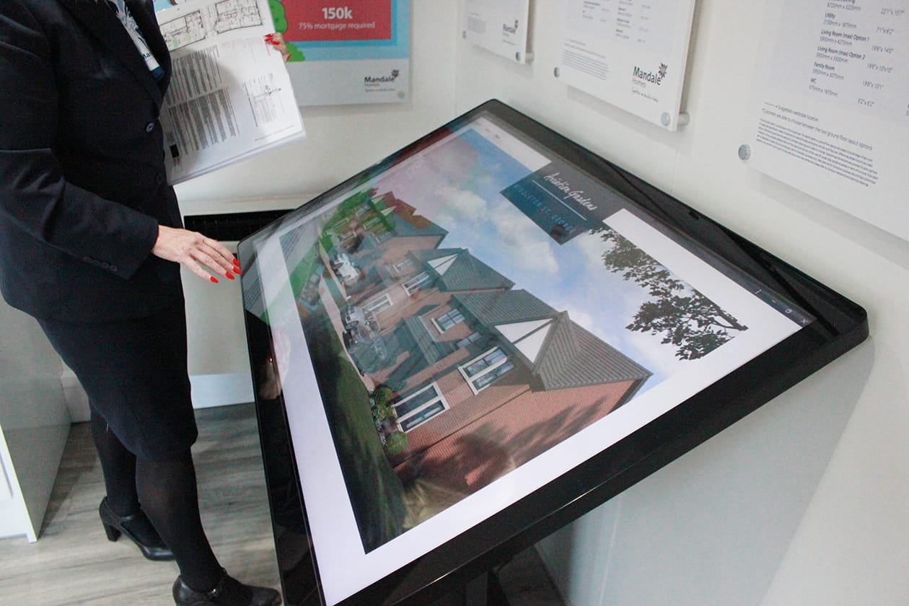
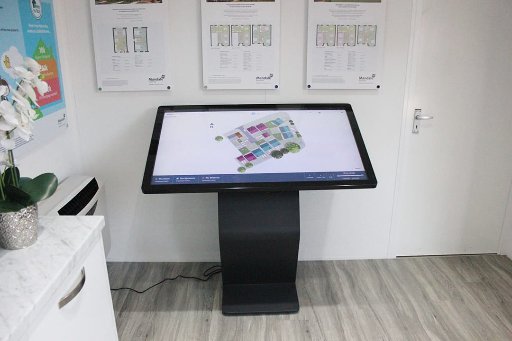

### Project Information

- **Project** - jQuery offline PWA kiosk system
- **Development Time** - ~3 months
- **Frontend** - Bootstrap, SCSS, JS (JQuery)
- **Backend** - Laravel Admin Panel & MySQL 5.7

[View full case study on company website](https://viacreative.co.uk/case-studies/mandale-homes)
