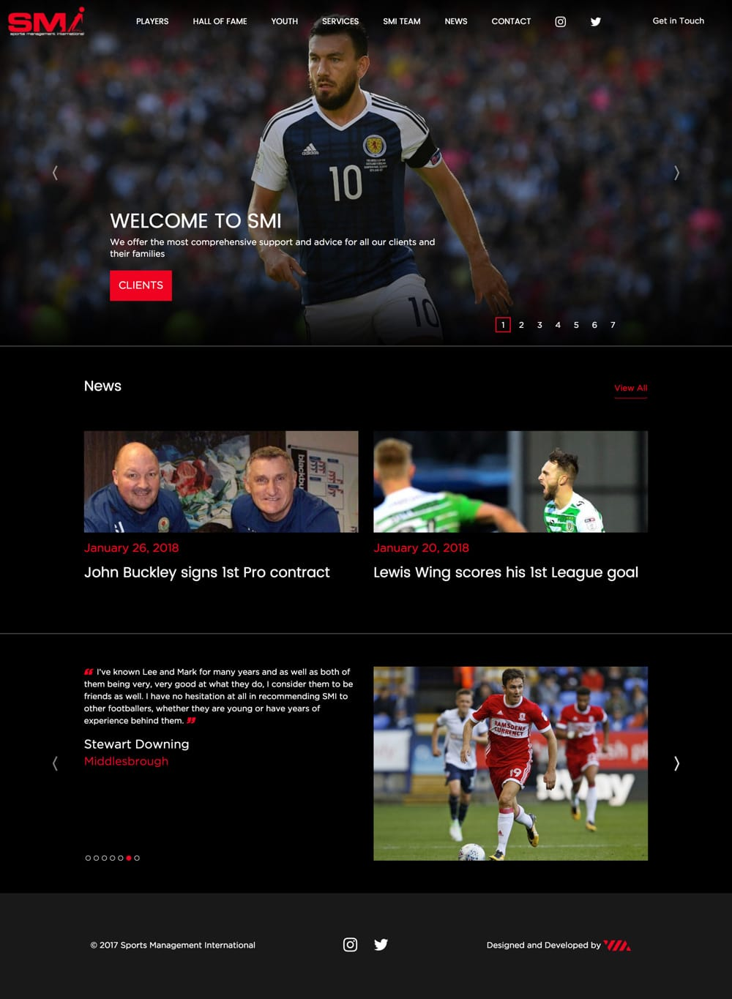

### Project Information

- **Project** - Bespoke website design and development
- **Development Time** - ~3-4 months
- **Frontend** - Bootstrap and Twig, SCSS
- **Backend** - OctoberCMS Admin Panel with custom plugins & MySQL 5.7

[View full case study on company website](https://viacreative.co.uk/case-studies/smi-world)
