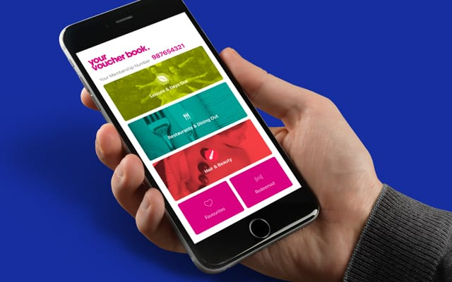
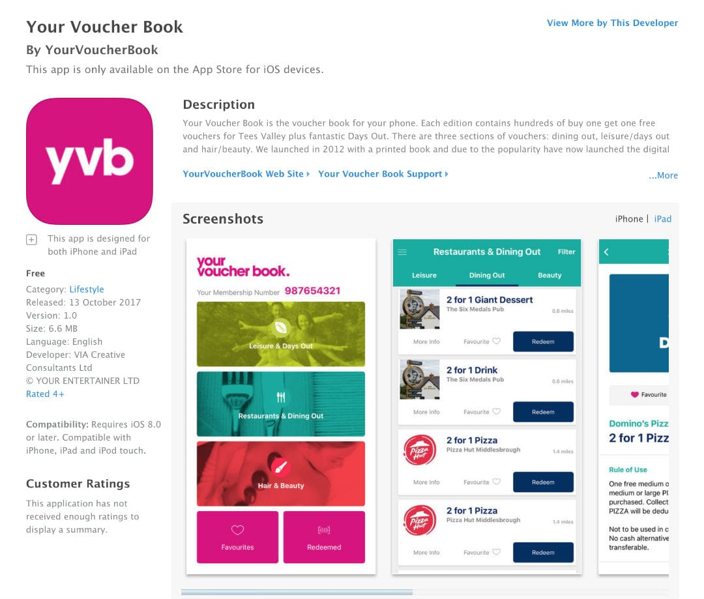

### Project Information

- **Framework** - Built using react-native
- **Features** - Geolocation, Voucher Redemption, Activation Code Redemption, Stripe Payment
- **Development Time** - ~3-4 months
- **Frontend** - Bootstrap and Laravel Blade, SCSS
- **Backend** - Custom Laravel 5.5 Admin Panel & MySQL 5.7

[View full case study on company website](https://viacreative.co.uk/case-studies/your-voucher-book)
